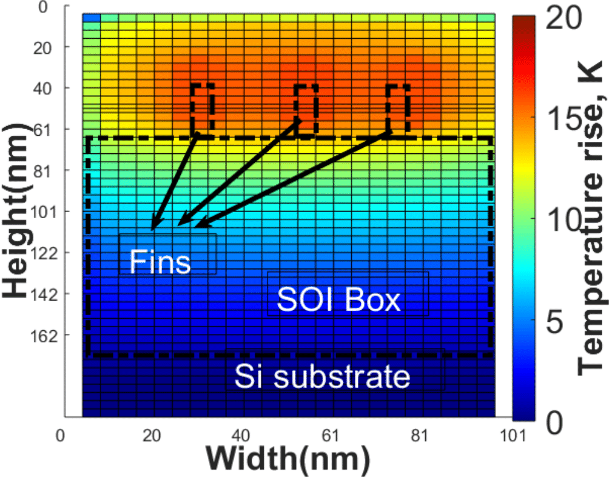

# TherMOS 
A thermal model for self-heating in advanced MOS devices.

[](https://commons.wikimedia.org/wiki/File:Blue_Python_3.6_Shield_Badge.svg)
[](https://github.com/VidyaChhabria/TherMOS/archive/master.zip)
[](https://github.com/VidyaChhabria/TherMOS/tree/master)
[](https://github.com/VidyaChhabria/TherMOS/issues)
[](https://opensource.org/licenses/BSD-3-Clause)

## Why TherMOS?


Self-heating is critical in modern devices with three
dimensional architectures and highly resistive thermal paths. 
TherMOS is a tool which estimates the temperature rise within advanced MOS
devices due to self-heating. It is developed from ground up using basic python
libraries. 

Key features are:
+ Simulation for different technologies at the change of a button (FinFET, MOSFET)
+ Improved run-times by using non-uniform meshing in FDM simulation
+ Fast multifin and multigate array simulation
+ One-stop-shop for device parameters compiled from literature sources for 7FF
  and 14nm FDSOI technologies


## Getting started

### Prerequisite

+ python3.6
+ pip 18.1
+ python3-venv
+ GNU Octave (optional)

Additionally, please refere to *reuirements.txt* file in this respository.
TherMOS is found to run well on Linux distributions.


### Install on machine

#### Setup

We use a python virtual environment to install all the required python libraries
using pip. 

``` bash
~$ https://github.com/VidyaChhabria/Thermal-model.git
~$ cd Thermal-model
~$ source install.sh
```

#### Run tests

TherMOS uses pytest for unit tests. 

`~$ pytest`

### Usage

TherMOS requires a *input/model_parameter_<device>.json* file which specifies the various parameters of
the device in consideration. The default parameters in the file
*input/model_parameter_MOSFET.json* for a planar 14nm FDSOI technology and are
obtained from literature sources as documented in *doc/FinFET_parameters.md*. 
The default parameters in the file *input/model_paramter_FinFET.json* are for 
7nm FinFET technology and have been obtained from literature sources as documented in *doc/MOSFET_parameters.md*.

The usage of TherMOS is as follows:

`python3 <process_type> -device_type <str> -n_gate <int>  -power <float> [-n_fin <int> | -width <float>] -active "<int_list>" -percent "<float_list>"


| Argument              	| Comments                                                                             	|
|-----------------------	|--------------------------------------------------------------------------------------	|
| -h, --help            	| Prints out the usage                                                                 	|
| <process_type>        	| Process and technology specification (str, required)                                 	|
| -n_gate <int>         	| Specifies the number of transistors in the simulation (int, required)                	|
| -power <float>        	| Specifes the total power dissipated by the array of transistors(s)                   	|
| -n_fin <int>          	| Number of fins in FinFET (required, int, use only when   <process_type> is FinFET)   	|
| -width <float>        	| Width of the MOSFET (required, float, use only when process is MOSFET)               	|
| -active    "int_list" 	| States the list of gate ids that are dissipating power (list of int,   optional)     	|
| -percent "float_list" 	| Percentage of power distributed between the active gates (optional,   list_of_float) 	|


After TherMOS completes execution, it generates a temperature report in the
output directory which contains the the maximum, and average temperature rise in
the transistor(s).

To view a graphic of temperature distribution within the transistor(s):

```
cd scripts
octave -r -nodisplay 'visualize_T';
```

The following outputs are generated by TherMOS:

- temperature.rpt: a report which states the maximum, minimum and average
  temperature of all the devices simulated.
- T.out: a python objet which is an array of temperatures that can be used in
  MATLAB to plot the temperature profile.
- T.png: an image with the 3D temperature contour plot of the simulated
  devices. 
 

## Limitations and Todo

- The software only handles transistors arrays that share a common diffusion
- Dockerize and CI


## License

This software is released under the BSD 3-Clause License.

>Copyright (c) 2019, The Regents of the University of Minnesota
>All rights reserved.
>
>Redistribution and use in source and binary forms, with or without
>modification, are permitted provided that the following conditions are met:
>
>1. Redistributions of source code must retain the above copyright notice, this
>   list of conditions and the following disclaimer.
>
>2. Redistributions in binary form must reproduce the above copyright notice,
>   this list of conditions and the following disclaimer in the documentation
>   and/or other materials provided with the distribution.
>
>3. Neither the name of the copyright holder nor the names of its
>   contributors may be used to endorse or promote products derived from
>   this software without specific prior written permission.
>
>THIS SOFTWARE IS PROVIDED BY THE COPYRIGHT HOLDERS AND CONTRIBUTORS "AS IS"
>AND ANY EXPRESS OR IMPLIED WARRANTIES, INCLUDING, BUT NOT LIMITED TO, THE
>IMPLIED WARRANTIES OF MERCHANTABILITY AND FITNESS FOR A PARTICULAR PURPOSE ARE
>DISCLAIMED. IN NO EVENT SHALL THE COPYRIGHT HOLDER OR CONTRIBUTORS BE LIABLE
>FOR ANY DIRECT, INDIRECT, INCIDENTAL, SPECIAL, EXEMPLARY, OR CONSEQUENTIAL
>DAMAGES (INCLUDING, BUT NOT LIMITED TO, PROCUREMENT OF SUBSTITUTE GOODS OR
>SERVICES; LOSS OF USE, DATA, OR PROFITS; OR BUSINESS INTERRUPTION) HOWEVER
>CAUSED AND ON ANY THEORY OF LIABILITY, WHETHER IN CONTRACT, STRICT LIABILITY,
>OR TORT (INCLUDING NEGLIGENCE OR OTHERWISE) ARISING IN ANY WAY OUT OF THE USE
>OF THIS SOFTWARE, EVEN IF ADVISED OF THE POSSIBILITY OF SUCH DAMAGE.

