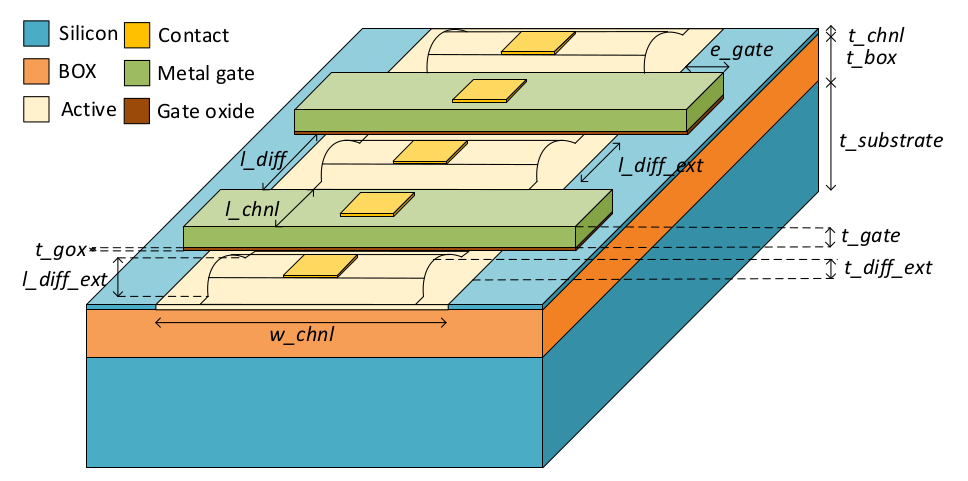
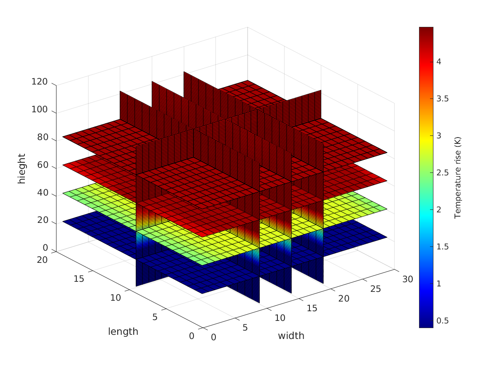

# Thermal model for planar bulk, SOI and NCFET devices
Thermal model to estimate rise in temperature due to self-heating in planar SOI/bulk/NC FET devices. The temperature is estimated using thermal-electrical equivalence where finding temperature at every node within the device amounts to calculating the voltage at each node in its corresponding electrical equivalent network. The software can estimate the temperature of one or more devices as long as they share the same continous diffusion. Please refer *./doc/UserGuide.md* for further details.

 

## Getting Started

### Prerequisute
- python 3.6
- pip 18.1
- python3-venv
- MATLAB (optional)

Additionally, please refere to *reuirements.txt* file in this respository.


#### Install on a bare-metal machine
`git clone --recursive https://github.com/VidyaChhabria/Thermal-model.git`

####

```
cd Thermal-model
```

## Usage

The various paramters to the thermal model such as the dimensions of the device and thermal conductivities of the materials are defined in *./input/model_paramters.json* file, which can be changed to any user-defined values. Please edit this file as necessary. The details on how the various paramters can be found in *./doc/UserGuide.md*

To run the software:

`python3 src/self_heating.py -tech SOI -n_gate 2 -width 120 -type NMOS -power 2.4e-6 -active {0,1}`

- *tech*: this variable specifies the technology of the planar transistor. Options include: SOI, Bulk, or  NC
- *n_gate*: number of devices/gate terminals to simulate that share a continous diffusion
- *width*: width of the transistors in nm
- *type*: NMOS/PMOS transistor
- *power*: total power dissipated by all gates
- *active*: the gates that are dissipating power

 After the program sucessfully executes, if you have MATLAB installed, to view the temperature profile:

```
cd scripts
matlab -r -nodisplay 'visualize_T';
```


The outputs include the following: 
 - temperature.rpt: a report which states the maximum, minimum and average
   temperature of all the devices simulated.
 - T.out: a python objet which is an array of temperatures that can be used in
   MATLAB to plot the temperature profile.
 - T.png: an image with the 3D temperature contour plot of the simulated
   devices.

## TODO and Known Issues

1) Support for NCFET devices not completed yet.
2) The software handles only trasistors which share a continous diffusion.
3) The distance from the source/drain terminal contacts to the outside via the C4 bumps is assumed to be 1000nm for now. 
4) The thermal conducitivty of Si within the channel is assumed to be scaled by 10x to account for phonon bounary scattering. 
5) The temperature plot can only be visualized in MATLAB for now.
6) The power is distributed based on the active gates. Total power is distributed equally between active gates. 
