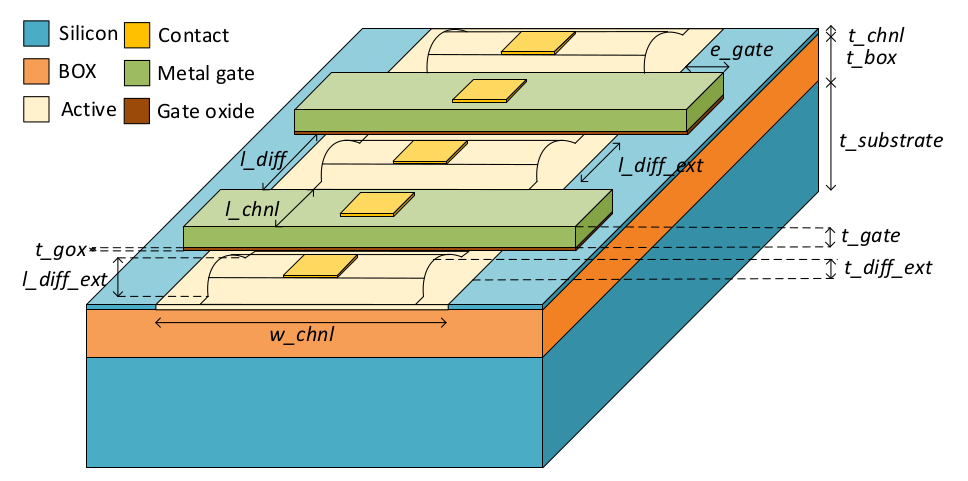

# TherMOS: MOSFET Parameters

This document explains the various paramteres in the
*input/model_parameters_FinFET.json* file

## A 14nm FDSOI MOSFET

The image below shows a 7nm Bulk FinFET which describes the variables
used the JSON file.

The table below lists the various values specified in the JSON file with
comments and pointers to their source:

| Variable      	| Value (nm) 	| Source 	| Comments                              	  |
|---------------	|------------	|--------	|--------------------------------       	  |
| l_chnl:       	| 20         	| [1]    	| Fig. 2                                    |
| t_box:        	| 25         	| [1]    	| Fig. 2                                    |
| t_substrate:  	| 500         | [1]     |                                           |
| t_gate:       	| 40         	| [1]  	  | Scaled from Fig. 2                        |
| t_chnl:       	| 6          	| [1]     | Page 1 Col. 2                             |
| t_gox:        	| 1          	| [1]    	| Experimental section                      |
| t_diff_ext:   	| 20         	| [1]     | Scaled from Fig. 2                        |
| l_gate_space: 	| 54         	| [1]    	| Scaled from Fig. 2                        |
| l_sd_junc     	| 40         	| [1]    	| Scaled from Fig. 2                        |
| l_diff_ext:   	| 40         	| [1]   	| Scaled from Fig. 2                        |
| l_cont:       	| 32         	| [2]    	| Table 1, extracted from M1 pitch          |
| w_cont:       	| 32         	| [2]    	| Table 1, extracted from M1 pitch          |
| e_gate:       	| 18         	| [3]    	| Scaled from 45nm Free PDK                 |
| t_cont        	| 48         	| [2]	    | Assuming thickness to width ratio of 1.5 	|

## References
[1] Q. Liu et al., "High performance UTBB FDSOI devices featuring 20nm gate length for 14nm node and beyond," IEEE International Electron Devices Meeting, pp. 9.2.1-9.2.4, 2013.

[2] O. Weber et al., "14nm FDSOI technology for high speed and energy efficient applications," Symposium on VLSI Technology (VLSI-Technology), pp. 1-2, 2014.

[3] "NCSU 45nm FreePDK", Available at https://www.eda.ncsu.edu/wiki/FreePDK45:PolyRules
