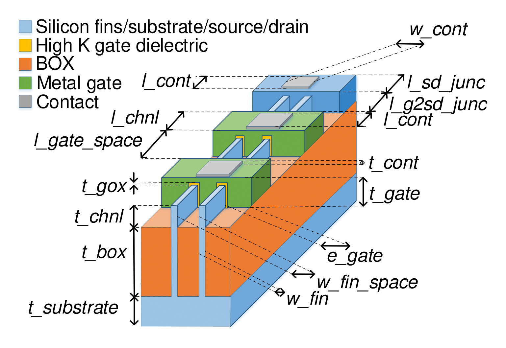

# TherMOS: A Brief User Guide
TherMOS is a creates a thermal model for self-heating in advanced MOS devices.
There are two primary paths for the flow of heat in FinFETs and planar MOSFETS:
-- Down towards the substrate of the device
-- Along the channel of through the source and drain contacts into the metal
  layer stack

The thermal model is based on the finite differences method (FDM),
the electrical-thermal equivalence can be used to build a thermal resistance network. 
The power dissipation (or heat) in each element is modeled as a current source. 
If there are *n* finite regions, then the temperature at each FDM node can be
obtained by solving a system of *n* linear equations: *GT=P*.

TherMOS is based on the work done in [Impact of Self-heating on Performance and Reliability in FinFET and GAAFET designs](https://ieeexplore.ieee.org/document/8697786)

## Download and Install TherMOS

We use a python3.6 virtual environment to install all the required python libraries
using pip18.1. 

``` bash
~$ git cone https://github.com/VidyaChhabria/TherMOS.git
~$ cd Thermal-model
~$ source install.sh
```

TherMOS uses pytest for unit tests. 

`~$ pytest`


## Input Parameter Files
TherMOS relies on a model paramter file which specifies various technology
specific paramters including device and material properties such as device
dimensions and thermal conductivities. 

### FinFET Parameter File
The file *input/model_parameters_FinFET.json* specifies the device dimensions
and thermal coductivities of the various maters used in a 7nm FinFET technology.

The image below shows a 7nm Bulk FinFET which describes the variables
used the JSON file.



The table below lists the various values specified in the JSON file with
comments and pointers to their source:


| Variable      	| Value (nm) 	| Source 	| Comments                                                          	|
|---------------	|------------	|--------	|-------------------------------------------------------------------	|
| l_chnl        	| 20         	| [1]    	| ASAP7 PDK Paper, Table 1.                                         	|
| t_box         	| 25         	| [2]    	| ASAP7 PDK ICCAD Presentation, Slide 48                            	|
| t_substrate   	| 500        	|        	|                                                                   	|
| t_gate        	| 44         	| [2]    	| ASAP7 PDK ICCAD Presentation, Slide 48                            	|
| t_chnl        	| 32         	| [2]    	| ASAP7 PDK ICCAD Presentation, Slide 48                            	|
| t_gox         	| 1.6        	| [2]    	| ASAP7 PDK ICCAD Presentation, Slide 48                            	|
| t_cont        	| 10         	|        	|                                                                   	|
| t_diff_ext    	| 20         	|        	|                                                                   	|
| l_gate_space  	| 34         	| [1]    	| ASAP7 PDK Paper, Table 1 (Gate pitch - channel  length)           	|
| l_diff_ext    	| 25         	| [1]    	| ASAP7 PDK Paper, Fig. 1. Scaled according to the other parameters 	|
| l_cont        	| 18         	| [1]    	| ASAP7 PDK Paper, Table 1                                          	|
| l_sd_junc     	| 20         	|        	|                                                                   	|
| l_g2sd_junc   	| 30         	| [1]    	| ASAP7 PDK Paper, Fig. 1. Scaled according to the other parameters 	|
| w_fin         	| 7          	| [1]    	| ASAP7 PDK Paper, Table 1                                          	|
| w_fin_space   	| 20         	| [1]    	| ASAP7 PDK Paper, Table 1                                          	|
| w_cont        	| 18         	| [1]    	| ASAP7 PDK Paper, Table 1                                          	|
| e_gate        	| 10         	| [1]    	| ASAP7 PDK Paper, Fig. 1. Scaled according to the other parameters 	|


### MOSFET Parameter File
The file *input/model_parameters_MOSFET.json* specifies the device dimensions
and thermal coductivities of the various maters used in a 14nm planar MOSFET technology.

### Tool Configuration File
The file *input/tool_config.json* specifies the various paramters that impact the
  accuracy of TherMOS results. The table below briefly explains each variable:

| Variable      | Value (nm)    | Comments                                                                                         |
|---------------|---------------|--------------------------------------------------------------------------------------------------|
| resolution    | [2.5,2.5,2.5] | Specifies the dimension of a fininte element in the FDM analysis                                 |
| t_sub2gnd     | 475           | Value is added to the thickness of the substrate ("t_substrate")                                 |
| t_cnt2gnd     | 10000         | Represents the distance between the source/drain terminal contacts and power pad via the PDN     |
| sp_edge       | 5             | Spacing between the device and the edge of the simulation region in *x*-direction; Do not change |
| t_sp_edge     | 20            | Spacing between the device and the edge of the simulation region in *z*-direction; Do not change |
| l_sp_diff_ext | 5             | Spacing between the device and the edge of the simulation region in *z*-direction; Do not change |


-- *resolution*: This specifies the size of each finite element in the Finite
Difference Method (FDM) simulation. This is an array of float bumbers that
represents the dimnension of the finite element in the *x*,*y*, and *z*-directions. 
A small value used here would provide a more accurate result at the
cost of run-time. It is recommended to use a larger value in the *z*-direction, due
to the large device dimensions in that direction and a smaller value in the *x*-
and *y*-directions.

-- *t_sub2gnd*: This variable is added to the variable *t_substrate* from the
input/model_parameter_<device> .json file. The effective substrate thickness is
*t_substrate + t_sub2gnd*. The *t_sub2gnd* variable has a different finite
element size. For reasonable run-times and accuracy it is recommended that the
value of this variable be 75% of the total substrate thickness.

-- *t_cnt2gnd*: This variable represents the distance between the the
source/drain terminal pin of the device and the thermal ambient via the BEOL
stack. Intuitively, this can be thought of as the equivalent metal distance from
the pin to the C4 bump via the power delivery network (PDN). 


## Running TherMOS

TherMOS requires a *input/model_parameter_<device>.json* file which specifies the various parameters of
the device in consideration. The default parameters in the file
*input/model_parameter_MOSFET.json* for a planar 14nm FDSOI technology and are
obtained from literature sources as documented in *doc/FinFET_parameters.md*. 
The default parameters in the file *input/model_paramter_FinFET.json* are for 
7nm FinFET technology and have been obtained from literature sources as documented in *doc/MOSFET_parameters.md*.

The usage of TherMOS is as follows:

`python3 <process_type> -device_type <str> -n_gate <int>  -power <float> [-n_fin <int> | -width <float>] -active "<int_list>" -percent "<float_list>"


| Argument              	| Comments                                                                             	|
|-----------------------	|--------------------------------------------------------------------------------------	|
| -h, --help            	| Prints out the usage                                                                 	|
| <process_type>        	| Process and technology specification (str, required)                                 	|
| -n_gate <int>         	| Specifies the number of transistors in the simulation (int, required)                	|
| -power <float>        	| Specifes the total power dissipated by the array of transistors(s)                   	|
| -n_fin <int>          	| Number of fins in FinFET (required, int, use only when   <process_type> is FinFET)   	|
| -width <float>        	| Width of the MOSFET (required, float, use only when process is MOSFET)               	|
| -active    "int_list" 	| States the list of gate ids that are dissipating power (list of int,   optional)     	|
| -percent "float_list" 	| Percentage of power distributed between the active gates (optional,   list_of_float) 	|

After TherMOS completes execution, it generates a temperature report in the
output directory which contains the the maximum, and average temperature rise in
the transistor(s).

To view a graphic of temperature distribution within the transistor(s):

```
cd scripts
octave -r -nodisplay 'visualize_T';
```


## Output Files

The following outputs are generated by TherMOS:

- temperature.rpt: a report which states the maximum, minimum and average
  temperature of all the devices simulated.
- T.out: a python objet which is an array of temperatures that can be used in
  MATLAB to plot the temperature profile.
- T.png: an image with the 3D temperature contour plot of the simulated
  devices. 


##  


## References
[1] L. T. Clark *et al.*, "ASAP7: A 7-nm finFET predictive process design kit," *Microelectronics Journal*, Volume 53, 2016.

[2] V Vashishtha *et al.*, "ASAP7 Predictive Design Kit Development and Cell Design Technology Co-optimization," *ICCAD Embedded Tutorial*, 2017.

[3] Q. Liu *et al.*, "High performance UTBB FDSOI devices featuring 20nm gate length for 14nm node and beyond," *IEEE International Electron Devices Meeting*, pp. 9.2.1-9.2.4, 2013.
